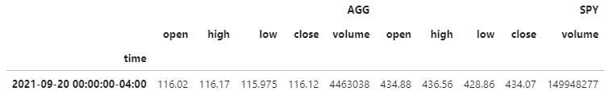
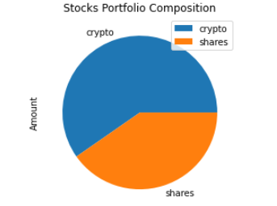
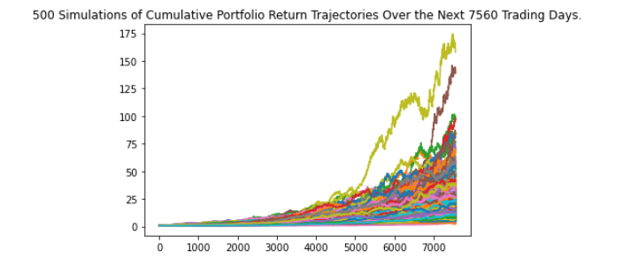
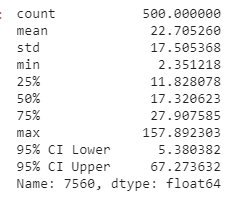

# Financial_Planning
Analysis of portfolio and projections for 5,10 and 30 years using Monte Carlo simulations
This porject's objective is to create a set of tools for investor to - one to visualize the preformance of their investements in this case mix of stocks and crypto currencies using historical closing prices and second to project 5, 10 and 30 years performace of the portifolio

## Personal Financial Planner
    The stock data was accessed using Alpaca Market APIs and an Alternative Free Crypto API was used to access Bitcoin and Ehterium closing prices. 
### Parse the data from alternative crypto api using .json() funtion
        btc_data = requests.get(btc_url).json()
        eth_data = requests.get(eth_url).json()

### Compute current values using respective codes from the dataset to retrieve respective closing prices of the crypto
        my_btc_value = my_btc * btc_data['data']["1"]['quotes']['USD']['price']
        my_eth_value = my_eth * eth_data['data']["1027"]['quotes']['USD']['price']

### Print current crypto wallet balance
        print(f"The current value of your {my_btc} BTC is ${my_btc_value:0.2f}")
        print(f"The current value of your {my_eth} ETH is ${my_eth_value:0.2f}")

### Used the alpaca trade API REST function to the load the dataset
'''
alpaca_api_df= tradeapi.REST(
    alpaca_api_key,
    alpaca_secret_key,
    api_version="v2"
)
'''

### Check if today's date is a weekend or US Holiday and if Markets are already closed for the day or not setup the closing prices for the last business day
### Using alpaca get_barset() function call we get the closing prices of that portfolio 
'''
closing_price_df = alpaca_api_df.get_barset(
    tickers, timeframe, 
    start = last_bus_day, 
    end = last_bus_day, 
    limit=1000 ).df
'''

# Compute the current value of shares
        agg_close_price = float(closing_price_df['AGG']['close'])
        spy_close_price = float(closing_price_df['SPY']['close'])
        my_agg_value = my_agg * agg_close_price
        my_spy_value = my_spy * spy_close_price

# Savings Analysis

### Setup monthly income to 1200 and create and a dataframe with stocks and crypto savings in it
'''
# Setup the dictionary to create the savings df
        data = {'Amount':[crypto_amt, shares_amt]}

### Create savings DataFrame using pandas DataFrame function
        df_savings = pd.DataFrame(data, index=['crypto','shares'])

### Validate that data frame was created with right data and structure
        display(df_savings)
'''
### Plot the savings data as a pie chart
'''
#Visualize the savings dataframe using pie chart
        pie_plot = df_savings.plot.pie(y="Amount", title="Stocks Portfolio Composition")

'''

### Initialize the emmergency fund as three times the monthly income and then compare the total savings (Stocks and Crypto combined) to the emmergency fund to find out it there are enough savings or not

## Retirement Planning
        Historical data for past 5years was retrieved for SPY and AGG using the Alpaca API "get_barset()" function, and Monte Carlo simulation was configured toforecast 30 years cumulative returns. MCForecastTools.py file has the MCSimulation class and was used to run the simulations
        
'''
### Configuring a Monte Carlo simulation to forecast 30 years cumulative returns
        mc_data  = MCSimulation(ticker_data, weights, num_simulations, num_days)
### Print the simulation input data
        mc_data.portfolio_data
### Run a Monte Carlo simulation to forecast 30 years cumulative returns
        mc_30year = mc_data.calc_cumulative_return()
'''

## Retirement Analysis
### Fetch summary statistics from the Monte Carlo simulation results
        sum_data = mc_data.summarize_cumulative_return()

### Use the lower and upper `95%` confidence intervals to calculate the range of the possible outcomes of our 20,000
        ci_lower = round(sum_data[8] * initial_investment, 2)
        ci_upper = round(sum_data[9] * initial_investment, 2)

### Results
    There is a 95% chance that an initial investment of $30000.0 in the portfolio over the next 30 years will end within in the range of $161411.45 and $2018208.96